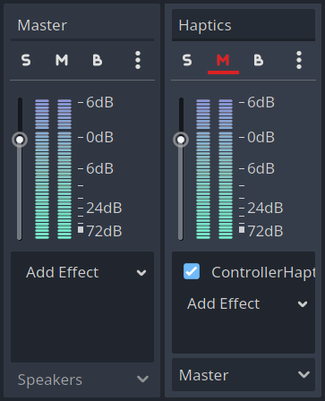

    
    <h2>Godot Audio Haptics</h2>

This native extension (GDExtension) for the Godot Game Engine allows you to use audio based controller haptics as found on DualSense or Switch Pro controllers on desktop platforms.

## Supported Controllers

- DualSense
- DualSense Edge (untested)

## Supported Operating Systems

- Linux with PipeWire
- Linux with PulseAudio
- Windows (untested)

## Usage

1. Download the latest [release](https://github.com/timoschwarzer/godot-audio-haptics/releases) of the extension and add it to your project
2. Create a new audio bus, mute it and add the `ControllerHaptics` effect to it
   
3. Play audio on the newly created haptics bus

## Support the author

If you like this extension, consider [sponsoring my open source work](https://github.com/sponsors/timoschwarzer) with either one-time or recurring donations. Thank you!

## License

[View the license](./LICENSE.md).

### See also

- [miniaudio](https://github.com/mackron/miniaudio) by David Reid
- [GDExtension CMake Template](https://github.com/asmaloney/GDExtensionTemplate) by Andy Maloney
